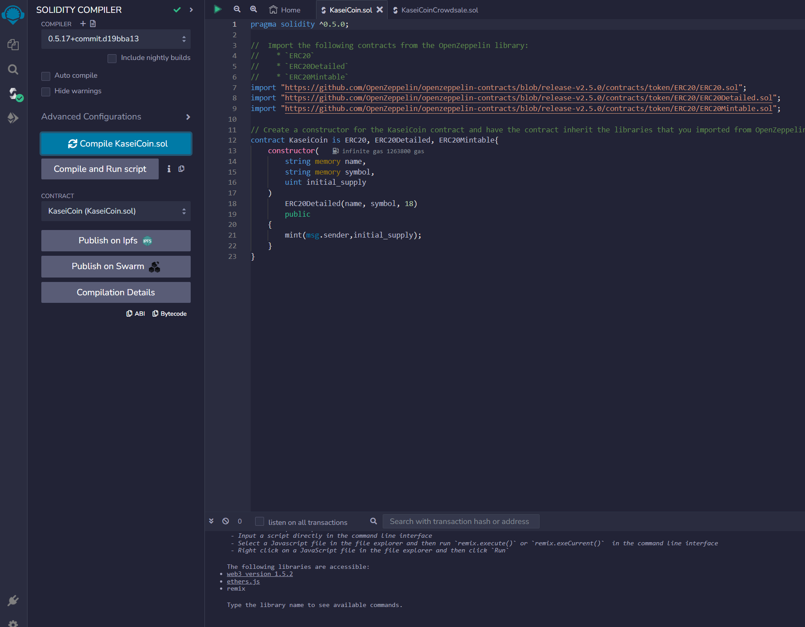

# Unit 21: Martian Token Crowdsale

## Background

After waiting for years and passing several tests, the Martian Aerospace Agency selected you to become part of the first human colony on Mars. As a prominent fintech professional, they chose you to lead a project developing a monetary system for the new Mars colony. You decided to base this new system on blockchain technology and to define a new cryptocurrency named **KaseiCoin**. (Kasei means Mars in Japanese.)

KaseiCoin will be a fungible token that’s ERC-20 compliant. You’ll launch a crowdsale that will allow people who are moving to Mars to convert their earthling money to KaseiCoin.

In the `README.md` file of your GitHub repository for this homework assignment, you’ll create a section named Evaluation Evidence. In this section, you’ll share screenshots of your work from each subsection of the assignment.

## Evaluation Evidence:

1. Take a screenshot of the successful compilation of the contract:'KaseiCoin', and add it to the Evaluation Evidence section of the `README.md` file for your GitHub repository.

    

2. Take a screenshot of the successful compilation of the contract, and add it to the Evaluation Evidence section of the `README.md` file for your GitHub repository.

    

3. Take a screenshot of the successful compilation of the contract: 'KaseiCointCroedsale Deployer', and add it to the Evaluation Evidence section of the `README.md` file for your Git repository.

   

8. Create a GitHub repository and a `README.md` file that explains the process for buying KaseiCoin.

Make sure that your `README.md` file includes screenshots that illustrate the functionality of your contracts as the earlier instructions detailed.

You can also record your interactions with the executed contract as a short video or an animated GIF. To record a video, you can use the following tools:

* If you’re working on macOS, you can create a screen recording by using the built-in QuickTime player. To learn more about this tool, refer to [Use QuickTime Player](https://support.apple.com/en-us/HT208721#quicktime) in the Apple Support documentation.

* If you’re working on Windows 10, you can create a screen recording by using the built-in Xbox Game Bar. To learn more about this tool, refer to [Use Xbox Game Bar to capture game clips and screenshots on Windows 10](https://beta.support.xbox.com/help/friends-social-activity/share-socialize/record-game-clips-game-bar-windows-10) in the Microsoft Support documentation.

* To create an animated GIF, you can use [Recordit](https://recordit.co/) on either macOS or Windows.

---

## Submission

* Upload the files for this assignment to your GitHub repository.

* Submit the link to your GitHub repo on Bootcamp Spot.

---

© 2021 Trilogy Education Services, a 2U, Inc. brand. All Rights Reserved.
